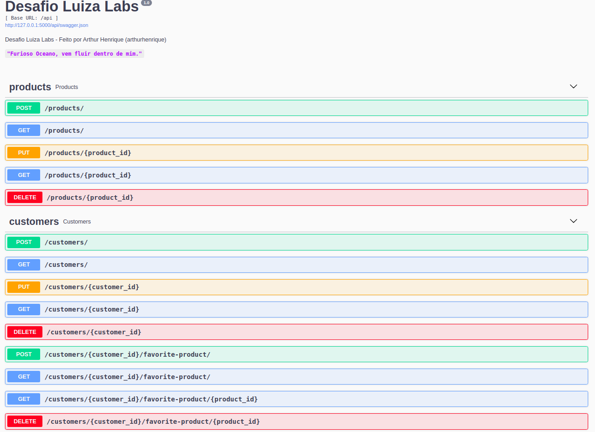

# luizalabs

Code Challenge Luiza Labs

This project runs on Python micro web framework: Flask.

-   Docker to deployment.

-   Uses Pytest in order to test.

## Requirements

-   Python3
-   Pip
-   Docker (to deployment)

## Installation

`make install`

## Database Helper

`make migrate`

## Runnning Localhost

`make run`

## Deploy app

`make deploy`

## Running Tests

`make test`

## Swagger Documentation

Access here:
[http://localhost:5000/api](http://localhost:5000/api)

## Project structure

Files related to application are in the `app` or `tests` directories.
Application parts are:

    app
    ├── blueprints              - business logic.
    │   └── api                 - web routes.
    ├── extensions              - application configuration, logging, etc..
    │   └── api                 - flask_restplus
    tests                       - pytest
